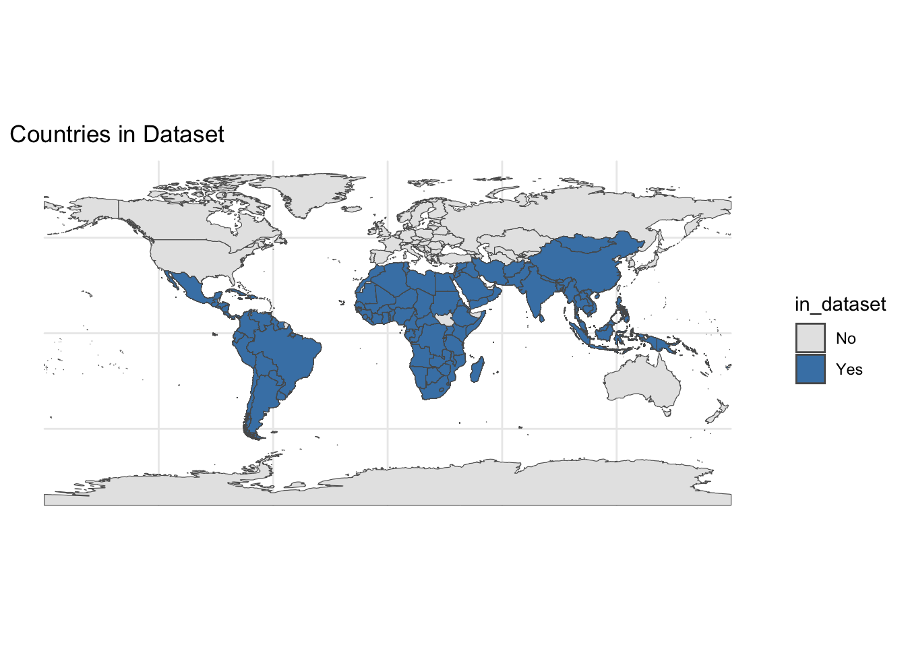
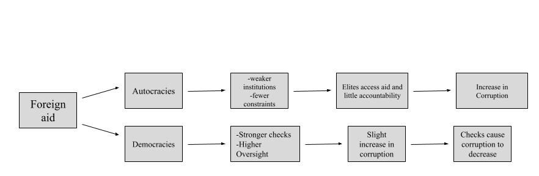
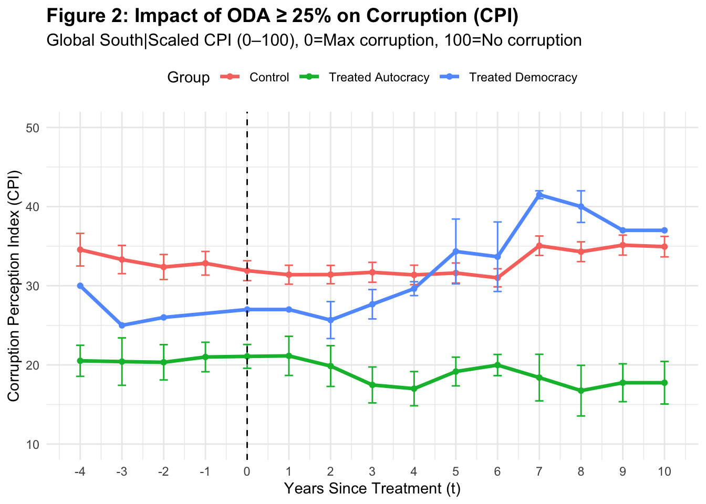
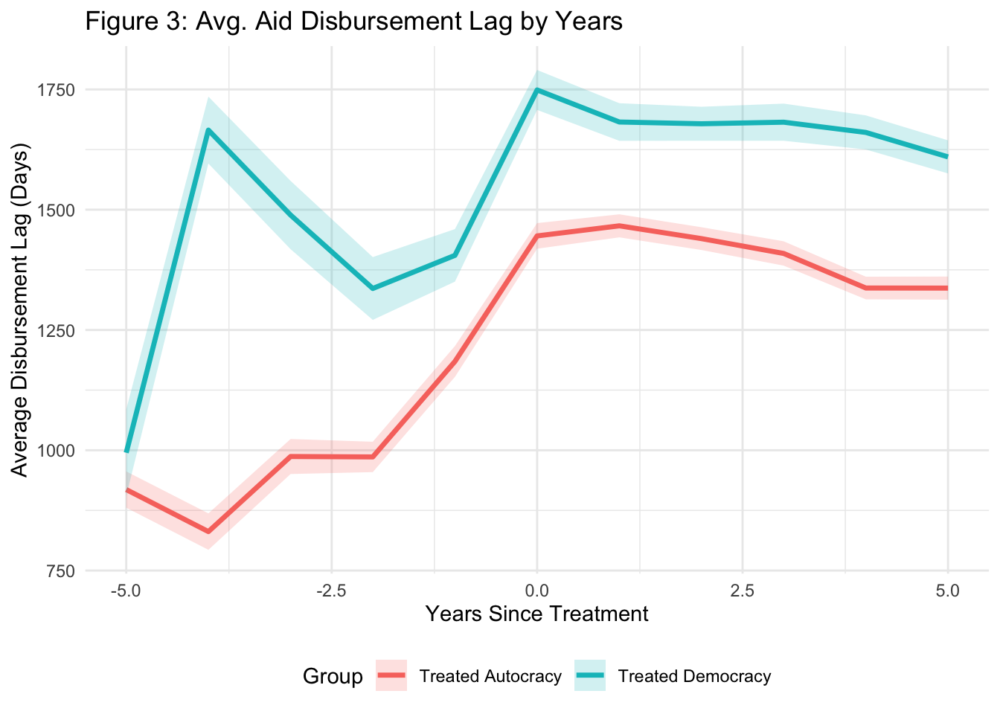
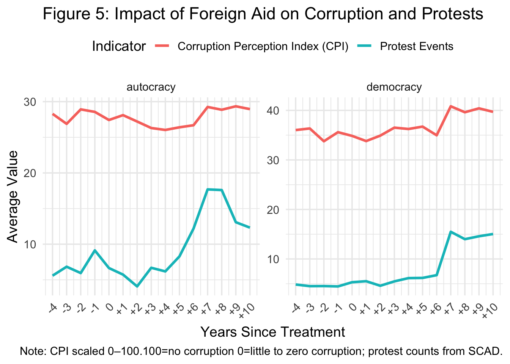

## Table of Contents

1.  Background
    i)  Context
    ii) Research Question
2.  Literature
3.  Empirics
    i)  Argument
    ii) Data
        i)  Methods
        ii) Figures
        iii) Findings
4.  Discussion
5.  Conclusion
6.  Limitations and Critiques

# Background {background-color="#40666e"}

## Background

### Context

-   Focus on Global South: Latin America, Sub-Saharan Africa, etc.

-   Low income Countries: More affected by aid, variance in impacts depending on income levels

    

## Background

### Research Questions

-   Foreign aid continues to be a primary tool of global engagement

-   Few studies fully integrate regime type, donor leverage, and transparency outcomes all together.

-   Can lead to more of an understanding in terms of how to fulfill donor goals in various regime types

## Background {visibility="uncounted"}

### Research Questions

**Today**:

:::: fragment
::: callout-tip
## Research Question

How does foreign aid affect corruption in varying regime types?
:::
::::

# Literature {background-color="#40666e"}

## Literature

-   **Camp One:** More corruption in autocracies, minimal to no impact on democracies
    -   *Kono et al., 2009*\
    -   *Nieto-Matiz et al., 2020*
-   **Camp Two:** Aid always causes corruption; regime type has no impact
    -   *Knack, 2003*\
    -   *Kaylvitis et al., 2012*\
    -   *Bader et al., 2001*
-   **Camp Three:** Donor intent matters, not regime type
    -   *Bermeo, 2011*\
    -   *Brown, 2005*

# Empirics {background-color="#40666e"}

## Empirics

### Argument and Theory

-   Autocracies: Lack of voter base leads to uncontrolled growth in corruption

-   Democracies: Corruption increases, need to appease voter base decreases it

## Empirics

### Methods

This study utilizes a differences and differences approach for the main Figure, Figure 2. The goal of this figure is to see the direct affect of corruption on the CPI value after 25% of the GNI is made up of ODA in the selected countries. For the remaining figures (3-5) , I utilized multiple forms of quantitative analysis to explain the mechanisms behind Figure 2.

Sources: Transparency International: CPI, World Bank: Income Level and Percent GNI of ODA, V-Dem: Regime Classification, CRS: Total ODA disbursements over time, The Strauss Center: Civil Unrest

For Figure 1: I utilized the following equation

$$
\text{CPI}_{it} = \sum_{k = -4}^{10} \beta_k \cdot \mathbb{1}(\text{EventTime}_{it} = k) + \alpha_i + \gamma_t + \varepsilon_{it}
$$

-   $\text{CPI}_{it}$: is the corruption score for country $i$ in year $t$,

-   $\mathbb{1}(\text{EventTime}_{it} = k)$: indicator for each year relative to treatment.

-   $\alpha_i$: Country fixed effects

-   $\gamma_t$: year fixed effects are included to account for time-invariant country characteristics and common shocks.

## Empirics

### Figures

*When looking at Figure 2, it can be seen that countries that received the "treatment" start to and continue to experience changes in CPI levels*

*This aid lag could explain why it takes longer for the ultimate change democracies experience (less corruption) takes several years to occur*

*The differences in aid allocation could explain why it takes longer for Autocracies to change. A majority of the aid in autocracies goes to problem management while a majority of aid in democracies goes to governmental sectors leading to more quick of a change in governmental corruption levels.*

*As can be seen above as protests occur in democracies, their corruption levels immediately decreases (CPI increases). This is due to the fact that democracies are reliant on the approval of their people to remain in power. Autocracies on the other hand seem to face no effects even as protests increase.*

## Empirics

### Findings

-   Figure A: two contrasting trends:

    -   Democracies: corruption decreases after an initial spike,
    -   Autocracies: corruption steadily worsens following the aid shock

-   Figure D: democracies have more of a lag: shows institutional checks, shows why corruption improvement in figure A is not immediate in democracies

-   Figure E:

    -   Autocracies: Aid goes in short term sectors,
    -   Democracies: Aid goes to government

-   Figure F: Protests in both

    -   Democracies: decrease in corruption
    -   Autocracies: corruption continues to increase

# Discussion {background-color="#40666e"}

## Discussion

-   Large aid inflows reshape governance differently across regimes

-   Democracies experience initial corruption shocks but institutions stabilize over time

-   Autocracies face entrenched corruption as repression and weak oversight persist

-   Public protest strengthens accountability in democracies but is suppressed in autocracies

-   Sectoral allocation determines outcomes: education and infrastructure enhance transparency, fungible aid fuels rent-seeking

-   Aid effectiveness is contingent on political context, not volume alone

-   Donors must align disbursements with institutional capacity and oversight to prevent misuse

# Conclusion and Application {background-color="#40666e"}

## Conclusions and Applications

***Conclusions:***

1.  The impact of aid is shaped by regime type
2.  Autocracies experience entrenched corruption with no reversal
3.  Democracies lessen corruption over time in order to satisfy the voter base, due to the voter base's protests
4.  Political context determines whether aid strengthens institutions or fuels rent-seeking

***Applications***

1.  Policy Design: Target aid to governance-enhancing sectors with strong oversight
2.  Donor Strategy: Condition aid on transparency and institutional reform
3.  Civic Engagement: Policy makers should support mechanisms that amplify protests and accountability in democracies

# Limitations and Critiques {background-color="#40666e"}

## Limitations and Critiques

-   Difference-in-Differences event study assumes that treated and control countries would have followed similar paths in the absence of high ODA inflows

-   Excludes sub-national differences:

    -   Somaliland

-   CPI is a perception-based measure, which may lag behind actual corruption changes or be biased by media coverage and international scrutiny.

-   Ignores Conditionality

-   Future studies could look at:

    -   Sub-national variation
    -   Different economic levels
    -   Donor type: Members of OPEC versus external sources i.e China

------------------------------------------------------------------------

\
               [Thank you!]{style="color:#107895; font-size: 80px"}\

Email: mariam.sahar09\@gmail.com\
Website: **https://msaharsajid.github.io**
