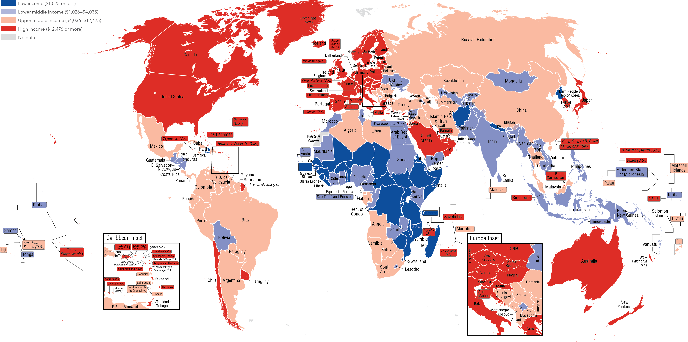
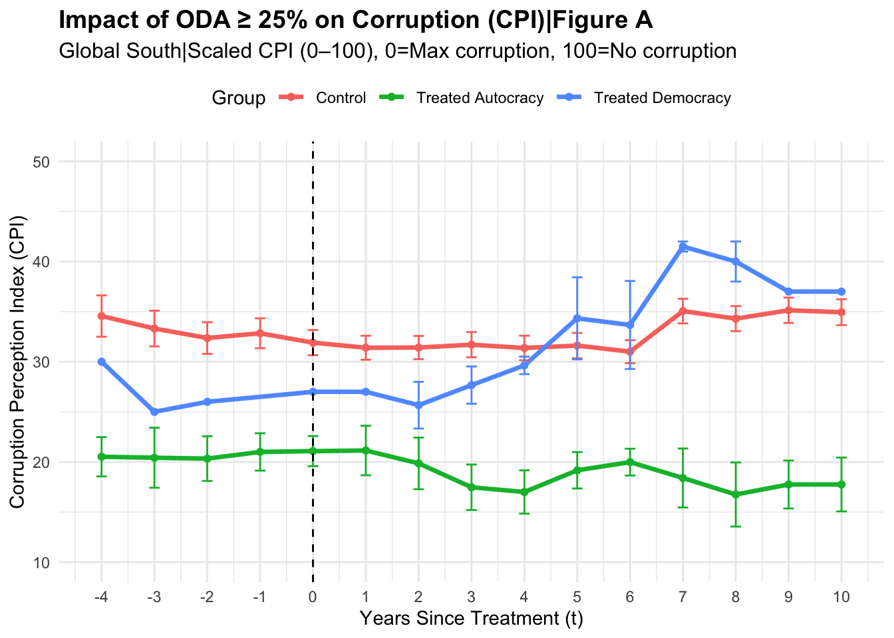
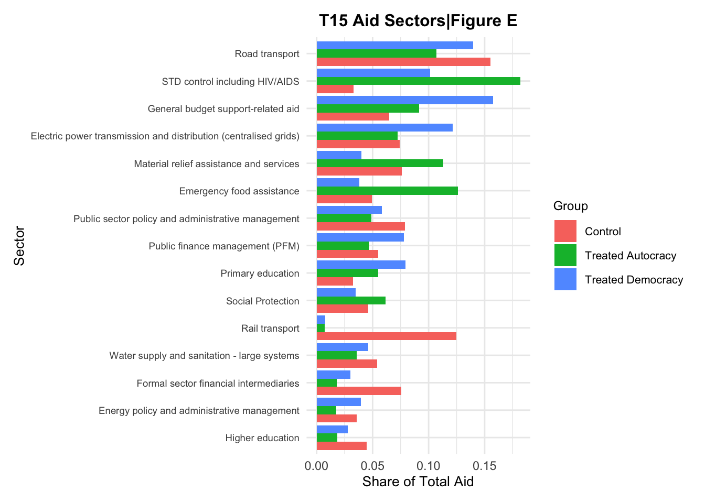
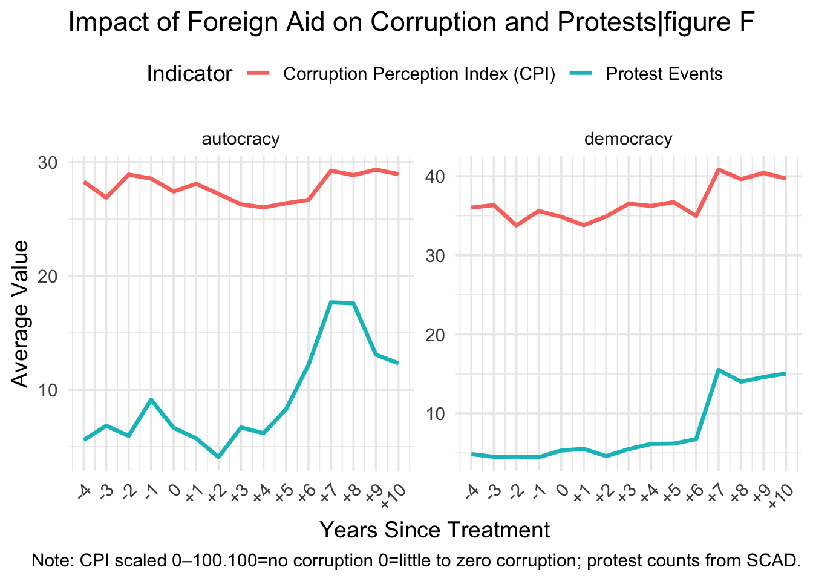

## Table of Contents

1.  Background
    i)  Context
    ii) Research Question
2.  Literature
3.  Empirics
    i)  Argument
    ii) Data
        i)  figure A
        ii) figure B
        iii) figure C
        iv) figure D
    iii) Findings
4.  Limitations and Critiques
5.  Conclusion

# Background {background-color="#40666e"}

## Background

### Context

-   Focus on Global South: Latin America, Sub-Saharan Africa, etc.

-   Low income Countries: More affected by aid, variance in impacts depending on income levels

    {width="728"}

    source: *World Bank*

## Background

### Research Questions

-   Foreign aid continues to be a primary tool of global engagement

-   Few studies fully integrate regime type, donor leverage, and transparency outcomes all together.

-   Can lead to more of an understanding in terms of how to fulfill donor goals in various regime types

## Background {visibility="uncounted"}

### Research Questions

**Today**:

:::: fragment
::: callout-tip
## Research Question

How does foreign aid affect corruption in varying regime types?
:::
::::

# Literature {background-color="#40666e"}

## Literature

-   **Camp One:** More corruption in autocracies, minimal to no impact on democracies
    -   *Kono et al., 2009*\
    -   *Nieto-Matiz et al., 2020*
-   **Camp Two:** Aid always causes corruption; regime type has no impact
    -   *Knack, 2003*\
    -   *Kaylvitis et al., 2012*\
    -   *Bader et al., 2001*
-   **Camp Three:** Donor intent matters, not regime type
    -   *Bermeo, 2011*\
    -   *Brown, 2005*

# Empirics {background-color="#40666e"}

## Empirics

### Argument and Theory

-   Autocracies: Lack of voter base leads to uncontrolled growth in corruption

-   Democracies: Corruption increases, need to appease voter base decreases it

## Empirics

### Data

**Figure A:** 

Sources: Transparency International: CPI, World Bank: Income Level and Percent GNI of ODA, V-Dem: Regime Classification

Approach: Differences in Differences:

$$
\text{CPI}_{it} = \sum_{k = -4}^{10} \beta_k \cdot \mathbb{1}(\text{EventTime}_{it} = k) + \alpha_i + \gamma_t + \varepsilon_{it}
$$

-   $\text{CPI}_{it}$: is the corruption score for country $i$ in year $t$,

-   $\mathbb{1}(\text{EventTime}_{it} = k)$: indicator for each year relative to treatment.

-   $\alpha_i$: Country fixed effects

-   $\gamma_t$: year fixed effects are included to account for time-invariant country characteristics and common shocks.

-   Used regression to show specific results

## Empirics

### Data

**Figure D:**

sources: V-Dem: Regime Type, CRS: Total ODA disbursements over time

**Figure E:**

sources: V-Dem: Regime Type, CRS: aid sectors

**Figure F:**

sources: V-Dem: Regime Type, Transparency International: CPI, The Strauss Center: Civil Unrest

## Empirics

### Findings

-   Figure A: two contrasting trends:

    -   Democracies: corruption decreases after an initial spike,
    -   Autocracies: corruption steadily worsens following the aid shock

-   Figure D: democracies have more of a lag: shows institutional checks, shows why corruption improvement in figure A is not immediate in democracies

-   Figure E:

    -   Autocracies: Aid goes in short term sectors,
    -   Democracies: Aid goes to government

-   Figure F: Protests in both

    -   Democracies: decrease in corruption
    -   Autocracies: corruption continues to increase

# Limitations and Critiques {background-color="#40666e"}

## Limitations and Critiques

-   Difference-in-Differences event study assumes that treated and control countries would have followed similar paths in the absence of high ODA inflows

-   Excludes sub-national differences:

    -   Somaliland

-   CPI is a perception-based measure, which may lag behind actual corruption changes or be biased by media coverage and international scrutiny.

-   Ignores Conditionality

-   Future studies could look at:

    -   Sub-national variation
    -   Different economic levels
    -   Donor type: Members of OPEC versus external sources i.e China

------------------------------------------------------------------------

\
               [Thank you!]{style="color:#107895; font-size: 80px"}\

Email: mariam.sahar09\@gmail.com\
Website: **https://msaharsajid.github.io**
